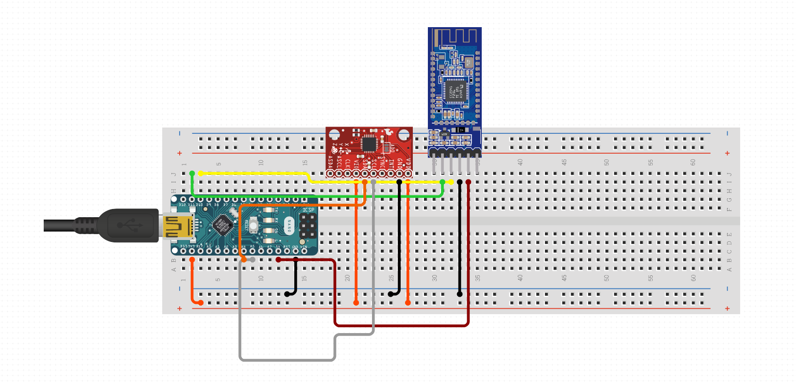

# Circuit



### Modules:

- Arduino Uno
- MPU-6050 accelerometer + gyroscope
- HM-10 Bluetooth LE

[Circuito model]: https://www.circuito.io/app?components=514,11022,11028,395589	"Circuito model"


# Memory layout


```
| 0 | 1 | 2 | 3 | 4 | 5 | 6 | 7 | 8 | 9 | 0 | 1 | 2 | 3 |   ...
---------------------------------------------------------   ...
| C | S |   X   |   Y   |   Z   |   X   |   Y   |   Z   |   ...
|   |   |         Side 1        |         Side 2        |   ...
```


| Flag | Type | Description |
| ---- | ---- | ---- |
| C | byte |Determines whether the device is calibrated.|
| S | byte |Determines the count of the sides.|
| X | int |Determines the X coordinate of the side.|
| Y | int |Determines the Y coordinate of the side.|
| Z | int |Determines the Z coordinate of the side.|

Taking the Arduino Nano EEPROM memory size into account (**512 bytes**), the maximum count of sides available for configuration is **85**. As it is more than enough, the maximum count is set to **25**.

Note that **int** type on Arduino allocates 2 bytes of memory.